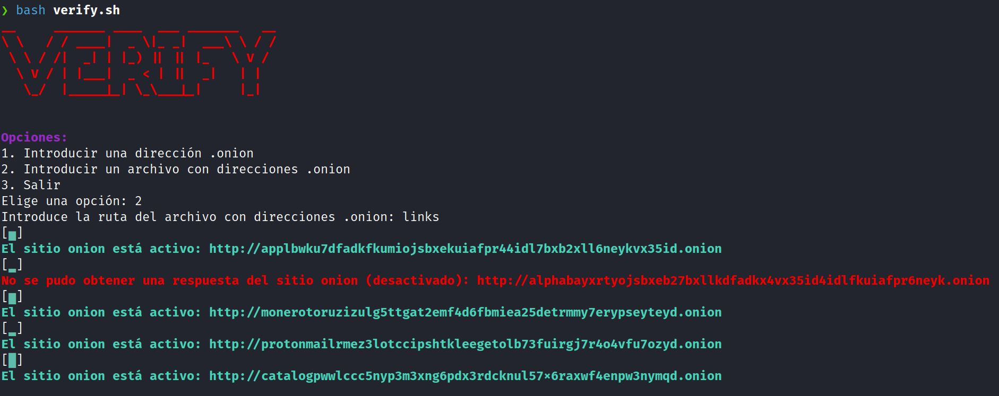

# Verify
Herramienta en bash para verificar si los sitios de la Red Tor .onion estan activados o desactivados antes de ingresar

Instalar 

git clone https://github.com/AndJ0x8/Verify

cd Verify/

bash setup.sh

systemctl start tor

bash verify.sh

  

  

  

